<p align="center">
    <a id="SAITS" href="#SAITS">
        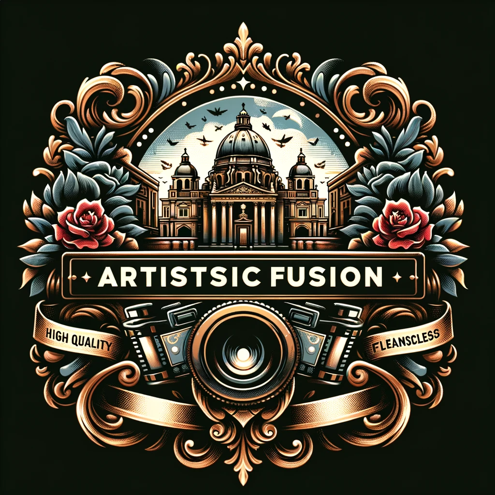
    </a>
</p>

<p align="center">
    
    
    
<a href="https://hits.seeyoufarm.com"></a>
</p>

# Artistic Fusion: Revolutionizing Mural Style Transfer with Combined GAN and Diffusion Model Techniques

The official code repository for the paper: **Artistic Fusion: Revolutionizing Mural Style Transfer with Combined GAN and Diffusion Model Techniques.**

## Introduction:

**Artistic Fusion**, is an image style transfer model base on CycleGAN and Stable Diffusion. At its core, CycleGAN establishes a reliable base for style accuracy, which is then significantly enhanced through our diffusion model adaptations. Classifier-guided and classifier-free guidance methods play a crucial role, enriched further by the integration of text-driven large diffusion models such as Stable Diffusion. Additionally, a pivotal exploration into the efficacy of superresolution models elevates the final output to high-resolution, achieving remarkable clarity and details. Our comprehensive methodology and rigorous experiments have led to promising results, achieving competitive performance in FID and LPIPS evaluation metrics, and possessing aesthetic and artistic purity.

In essence, **Artistic Fusion** is more than an addition to the compendium of image style transfer methods; it is an approach that aligns the humankind's aesthetic and artistic cravings with modern intricate style transfer technologies.

🤗 Please cite [Artistic Fusion](https://github.com/Learner209/artistic-fusion) in your publications if it helps with your work. Please star🌟 this repo to help others notice Artistic Fusion if you think it is useful. Thank you! BTW, you may also like [`CycleGAN`](https://github.com/junyanz/pytorch-CycleGAN-and-pix2pix), [`stable-diffusion-webui`](https://github.com/AUTOMATIC1111/stable-diffusion-webui), the two great open-source repositories upon which we built our architecture.

> 📣 Attention please: <br> > **Artistic Fusion** is developed heavily under the framework of [stable-diffusion-webui](https://github.com/AUTOMATIC1111/stable-diffusion-webui), an ultra-awesome project clustering copious diffusion-based generative models. Its instellation of image generaitive models provided us with a plentiful playground with munificient probablities. An example of using stale-diffusion-webui for generating image variation(a indispensable component of our final model) results are shown below. With [stable-diffusion-webui](https://github.com/AUTOMATIC1111/stable-diffusion-webui), easy peasy! 😉

## ❖ Contributions and Performance

⦿ **`Contributions`**:

1. Our approach leverages the Latent diffusion model (LDM) as a baseline, which we explore several innovative techniques such as variance learning and optimized noise scheduling. These modifications allow for a more nuanced and faithful representation of mural styles.
2. We explore the use of DDIM sampling to improve the efficiency of the generative process. We also delve into the world of large text-conditional image diffusion models like Stable Diffusion, utilizing textual prompts to guide the style transfer process more effectively. This integration of conditional guidance is particularly groundbreaking, enabling our model to interpret and apply complex mural styles with unprecedented accuracy and diversity.
3. We integrate super-resolution techniques, scaling the generated images to higher resolutions without losing the essence of the mural style. This step ensures that our outputs are not just stylistically accurate but also of high fidelity and detail, suitable for large-scale artistic displays.
4. Our model not only achieves competitive results on evaluation metrics such as FID and LPIPS metrics but also exhibits more aesthetic and artistic details.

⦿ **`Performance`**: **Artistic Fusion** : Currnently, we reported our FID score at 116 and our LPIPS score at 0.63.

## ❖ Brief Graphical Illustration of Our Methodology

Here we only two main variations of our method: the GAN+Diffusion pipeline and the Diffusion+GAN pipeline. For the detailed description and explanation, please read our full paper if you are interested.

GAN+Diffusion pipeline, with GAN-based solid style transfer capabilities, coupled with diffusion-enhanced variety and vitality(but deviates from the style transfer intent too easily):

<!-- <p align="center">
    <a id="SAITS" href="#SAITS">
        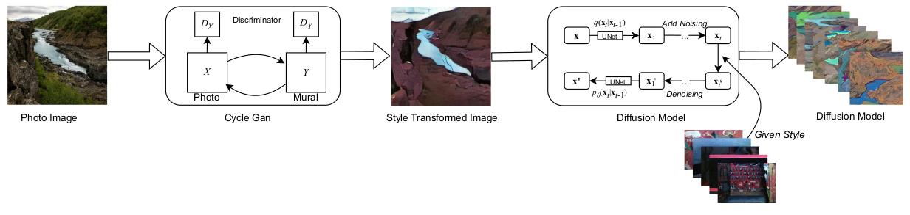
    </a>
</p> -->


Our final model: Diffusion + GAN framework, with Stable diffusion models' generative capabilities injected, followed by CycleGAN's style transfer pipeline.

<!-- <p align="center">
    <a id="SAITS" href="#SAITS">
        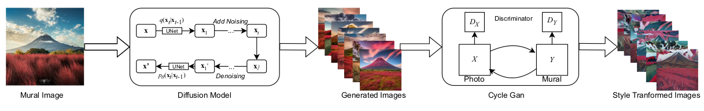
    </a>
</p> -->


## ❖ Development Environment

We run on `Ubuntu 22.04 LTS` with a system configured with $8\times$ NVIDIA RTX A40 GPU.

-   Use conda to create a env for **Artistic fusion** and activate it.

```bash
conda create -n ldm python=3.10
conda activate ldm
```

-   Then running the `webui.sh`, the activated environment will automatically flow into installation process.

```
./webui.sh
```

Additionally, if you want to reproduce image-variation results in the paper(based on `sd-unclip-h.ckpt`), please refer to the [latent diffusion](https://github.com/CompVis/latent-diffusion) repo !🤗

Also, if you want to reproduce other style transfer results in the paper, please refer to the cycleGAN directory and more specifically, the file, for other training detail queries, please contact our author [qisiyuan](qisiyuan7936@sjtu.edu.cn).

## ❖ Datasets

We run on one image style transfer dataset.

Here are some samples from our style image dataset:

<!-- <p align="center">
    <a id="SAITS" href="#SAITS">
        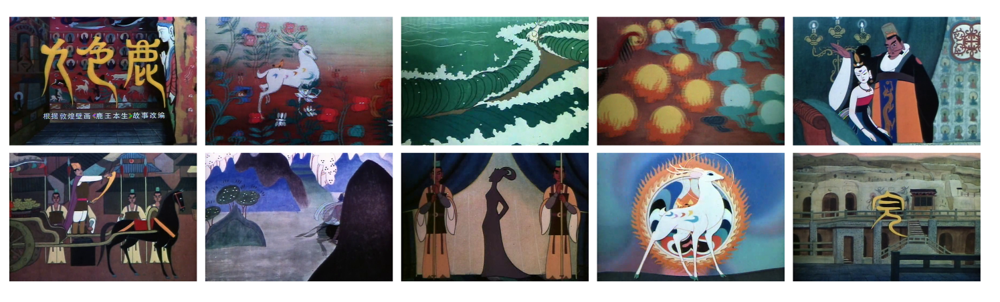
    </a>
</p> -->


## ❖ Usage

We use the CycleGAN model as our backbone, and train it on our mural-paining dataset. Also please take a tour to [`CycleGAN`](https://github.com/junyanz/pytorch-CycleGAN-and-pix2pix) repo for further details. The stable diffusion model is also used to produce munificient and copious image variation results. We have extended our diffusion-based model exploration journey among [ControlNet](https://github.com/Mikubill/sd-webui-controlnet), [T2I adapter](https://github.com/TencentARC/T2I-Adapter), [Dreambooth](https://github.com/d8ahazard/sd_dreambooth_extension), [Lora](https://github.com/bmaltais/kohya_ss) fine-tuning on SDXL and [INST](https://github.com/zyxElsa/InST).

## ❖ Quick Run

<details open>
  <summary><b>👉 Click here to see the example 👀</b></summary>

Please see the `experiment.ipynb` notebooks under the `cyclegan` directory for reference about the training procedure and inference pass of our best model.

<!-- <p align="center">
    <a id="SAITS" href="#SAITS">
        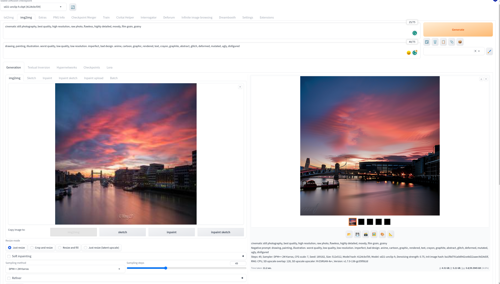
        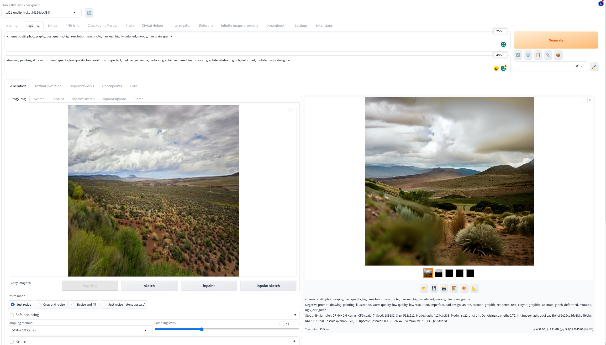
    </a>
</p> -->


Some image browsing tools to help you go over your collections quickly and efficiently.

<!-- <p align="center">
    <a id="SAITS" href="#SAITS">
        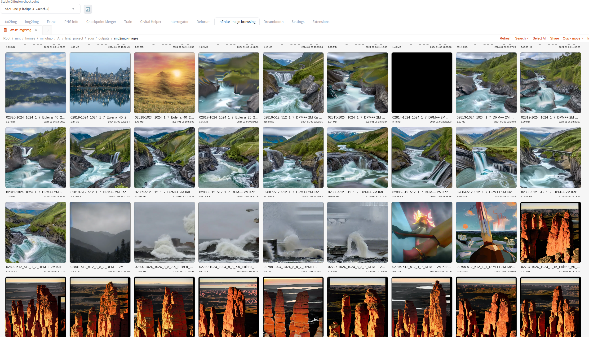
        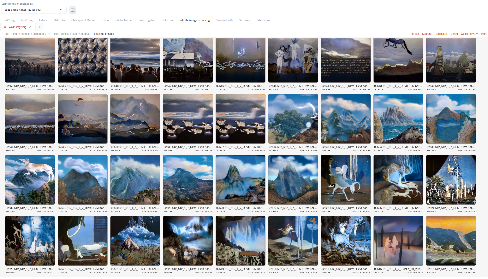
    </a>
</p> -->


</details>

❗️Note that paths of datasets and saving dirs may be different on your PC, please check them in the configuration files.

## ❖ Experimental Results

Samples of our CycleGAN result:

<!-- <p align="center">
    <a id="SAITS" href="#SAITS">
        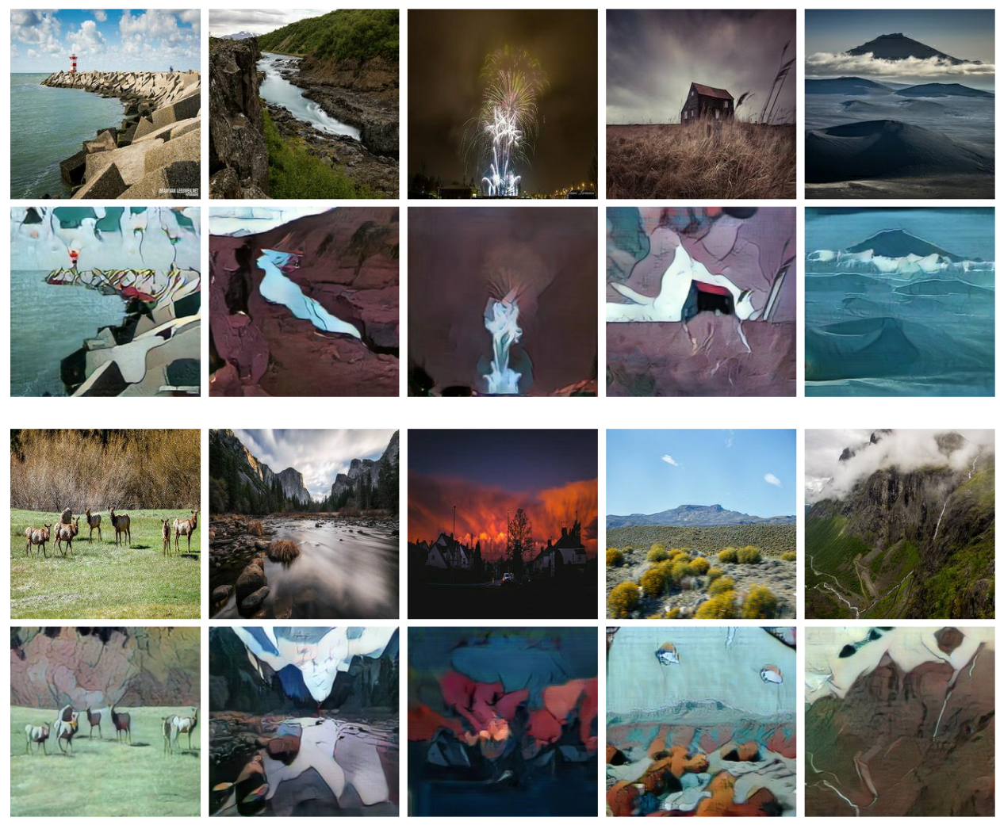
    </a>
</p> -->


Samples of our image variation result:

<!-- <p align="center">
    <a id="SAITS" href="#SAITfiS">
        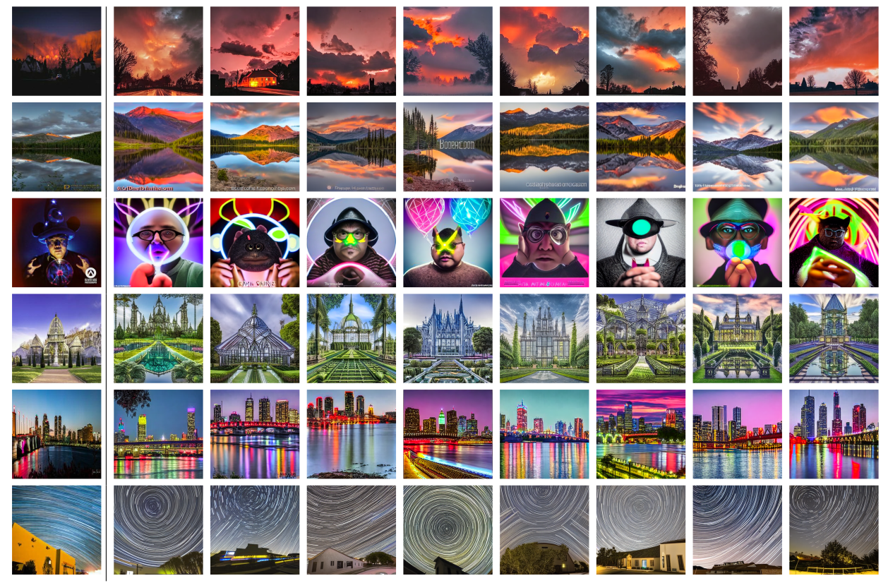
    </a>
</p> -->


Samples from our GAN+Diffusion pipeline:

<!--
<p align="center">
    <a id="SAITS" href="#SAITS">
        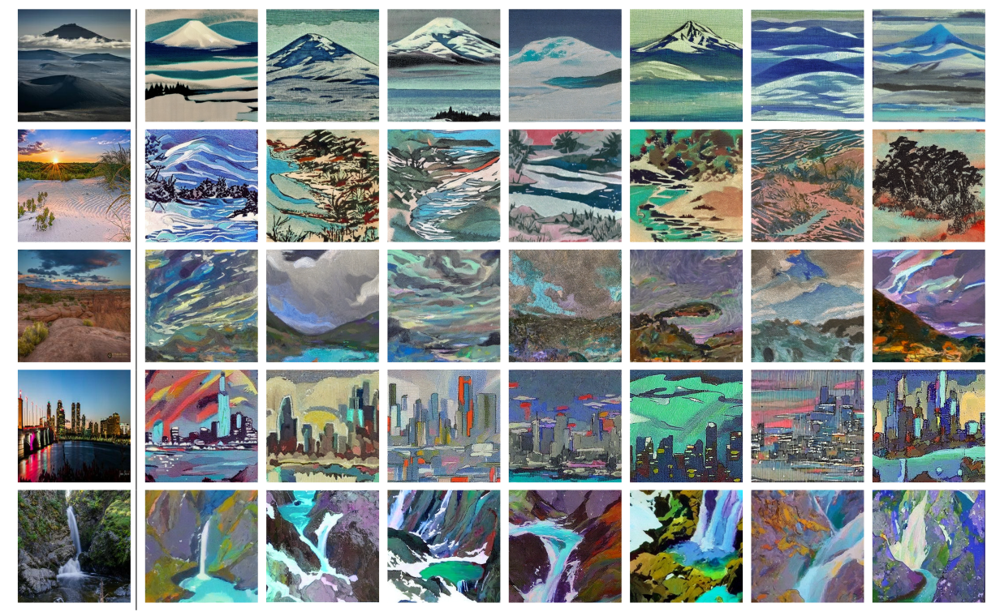
    </a>
</p> -->


More results drawn from our final model's style transfer results:

<!-- <p align="center">
    <a id="SAITS" href="#SAITS">
        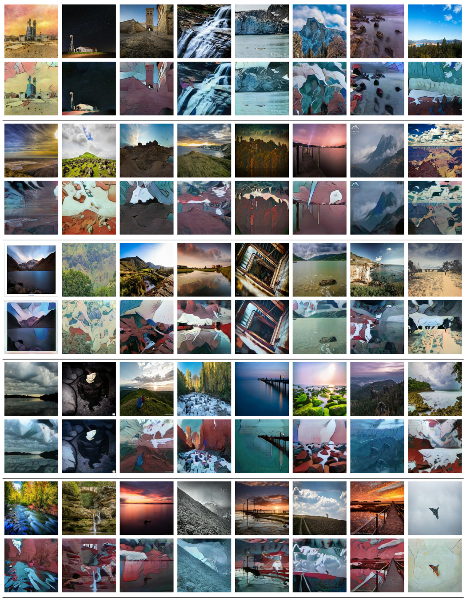
    </a>
</p> -->


<!-- <p align="center">
    <a id="SAITS" href="#SAITS">
        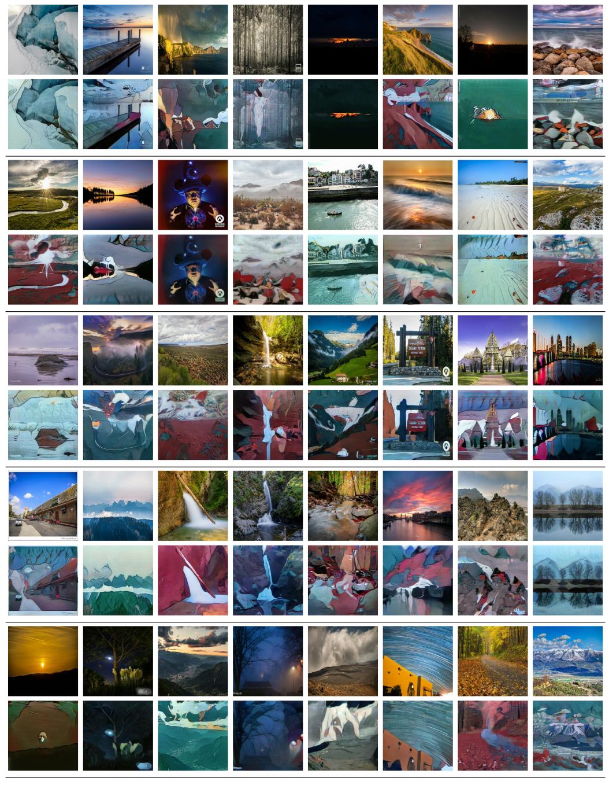
    </a>
</p> -->


## ❖ Acknowledgments

I extend my heartfelt gratitude to the esteemed faculty and dedicated teaching assistants of AI3603 for their invaluable guidance and support throughout my journey in image processing. Their profound knowledge, coupled with an unwavering commitment to nurturing curiosity and innovation, has been instrumental in my academic and personal growth. I am deeply appreciative of their efforts in creating a stimulating and enriching learning environment, which has significantly contributed to the development of this paper and my understanding of the field. My sincere thanks to each one of them for inspiring and challenging me to reach new heights in my studies.

### ✨Stars/forks/issues/PRs are all welcome!

## ❖ Last but Not Least

If you have any additional questions or have interests in collaboration,please feel free to contact me at [songshixiang](songshixiang@sjtu.edu.cn), [qisiyuan](qisiyuan7936@sjtu.edu.cn), [liuminghao](lmh209@sjtu.edu.cn) 😃.
